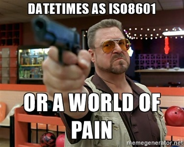

# ISO8601 or GTFO

When sending date-time data between systems, your options fall into two general categories:
 
 1. [ISO8601](https://en.wikipedia.org/wiki/ISO_8601) with an explicit timezone, or 
 2. A world of pain.
 


Do you want a world of pain? I didn't think so.
 
## ISO8601

```json
{
  "OrderId": 123456,
  "OrderDue": "2017-04-05T14:30Z"
}
```

*The order is due at 2:30PM UTC on the 5th of April, 2017*.

ISO8601 is a format where all parts of the date or datetime are laid out in a structured way, largest to smallest. It is human readable and can be unambiguously parsed by code.

Largest to smallest is also a logical ordering: When measuring duration, would you say "seven hours, three days and fifteen minutes"? Of course not, the order largest to smallest makes the most logical sense, so you'd say "three days, seven hours and fifteen minutes". 

When measuring distance, would you say "Two feet, three yards and an inch"? Of course not, and not just because you should use the metric system.

Largest to smallest ordering has the pleasing side-effect that an alphabetic sort of these values is also a chronological sort.

There is a lot more to it, I am not going to define it all here, just convince you that it is the right way. Read [the excellent wikipedia page](https://en.wikipedia.org/wiki/ISO_8601), [the RFC](https://tools.ietf.org/html/rfc3339), or [get the specification](http://www.iso.org/iso/home/standards/iso8601.htm) itself.
 
## Other options 

And why they suck.

### UK or US date format

These are the twins: `DD/MM/YYYY` and `MM/DD/YYYY`. You might be used to reading one of them, but they are terrible for data interchange as they look the same but mean different things. Use one of these formats only if you want these problems caused by confusing them:

* Differences in date parsing functionality between different machines with different system settings. What works on one machine may or may not work on another machine, and may or may not give the same result.
* Code that works for the first 12 days of the month only, and then fails.
* Stored values that might mean one of two completely different dates, depending on how they were parsed.
* How does time zone info fit into these formats anyway?

In short, unless you want _a world of pain_, avoid these date formats for data interchange and storage.

### Epoch seconds

[Unix time (also known as POSIX time or Epoch time) is defined as the number of seconds that have elapsed since 00:00:00 UTC, Thursday, 1 January 1970](https://en.wikipedia.org/wiki/Unix_time)

This format ay be fine for system administration uses, or e.g. timestamping log entries. But it is not suitable for recording most business date and time values because:

- Epoch values are not human readable. Don't underestimate this. Many bugs are caught because anyone can see that the value is wrong. This won't happen with epoch dates.

- Epoch values do not store time zone info at all. 10AM in London coincides with 11AM in Paris, but there are cases when the difference is significant. 

- Epoch values are always UTC. But did you know that before today? There is high probability that someone can get this implicit rule wrong when generating a value, or when reading it.  Explicit, human-readable time zone is better.


- Epoch values are always the same precision. What if you want to express "it happened on the 12th of Feb, 2017, all day" - in ISO8601 this is `2017-02-12`, but in epoch date you have to specify the time of day as well. Probably you'll use an implicit convention that midnight at the start of day stands in for the whole day, right? Midnight in UTC or in your local time zone?  Now you have implicit rules that someone will get wrong, and you can't store both "just the date" and "actual precise midnight value". A timezone issue one hour backwards is likely to push the value not just to the wrong hour but to the wrong day. The worst case is that you run into this kind of bug when the clocks change, up to six months later.

The common theme is that there are many implicit decisions and ways to miscommunicate wrapped up in the single integer value of the epoch date. 

## Summary

Save yourself a whole lot of trouble - insist that data is sent in ISO8601 format with an explicit time zone.
